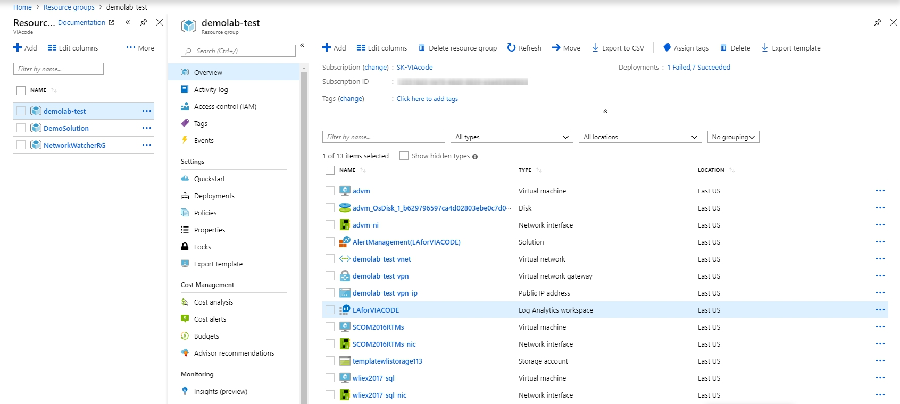

# SCOM Alert Management solution

## Overview

The SCOM Alert Management solution extends capabilities of Microsoft Alert Management solution with automation of alert rules creation for System Center Operations Manager management group connected to the Log Analytics workspace. The solution creates an alert rule for each SCOM alert type. After Alert rule is available on Azure Monitor, you can manage them as standard scheduled query rules. At the same time, the solution closes SCOM Alerts generated by standard Alert Management solution. Key Scenarios, not available in the Microsoft Alert Management solution:

- Automatically create Azure Alert Rules for all SCOM alerts.
- Propagate SCOM Alert description into Azure Alert events.
- Support enabling and disabling of Azure Alert generation for corresponding SCOM Alerts.
- Support integration scenarios, such as webhooks, action groups, etc.

## Prerequisites

Before starting, review the following requirements.

- Download and set up System Center Operation Manager from [here](https://docs.microsoft.com/en-us/system-center/scom/manage-operations-guide-overview?view=sc-om-1807).
- Create a Log Analytics workspace in the Azure portal from [here](https://docs.microsoft.com/en-us/azure/azure-monitor/learn/quick-create-workspace).
- Connect Operations Manager to Azure Monitor from [here](https://docs.microsoft.com/en-us/azure/azure-monitor/platform/om-agents).
- Add the Alert Management solution to your Log Analytics workspace.

### Demo overview

Our demo environment consists of 3 Windows VMs and Log Analytics workspace:

- **advm** - AD controller.
- **SCOM2016RTMs** - SCOM2016RTMs server.
- **wli2017-sql** - VM with SQL 2017 instance added to the SCOM  Management Group.
- **LAforVIACODE** - Log Analytics workspace that is already connected to the SCOM, and Alert Management Solution installed into this workspace

## Install SCOM Alert Management solution

1. Log in to the Azure portal.
2. Open **All Services** and locate **Solutions**.
3. Click **Add** and find **SCOM Alert Management** solution.

4. Click **Create** to start the installation process.

5. When the installation process starts, you're prompted to provide required configuration.

### Configuration

1. Configure basic settings

- Select a Subscription to link to by selecting from the drop-down list if the default selected is not appropriate.
- For Resource Group, choose to use an existing empty resource group or create a new one.
- Select the same Location as in Log Analytics.

2. Log Analytics Settings

- Type the Log Analytics workspace Resource Group name
- Type the Log Analytics workspace name

3. Summary

- You're prompted to provide information such as the resource group and location in addition to values for any parameters in the solution

4. Buy

- User can read Terms of Use and [Private Policy](https://www.viacode.com/viacode-privacy-statement)

## Verify monitoring solution deploy

The solution is in a separate resource group and includes two logic apps.

- [x] **AlertCreator** creates a new alert rule.
- [x] **CloseAlerts** closes the original Alert Management solution (unmanageable alerts).

## Automatically create Azure Alert Rules for all SCOM alerts

1. Take offline "testDB" Database on the client **wli2017-sql**

