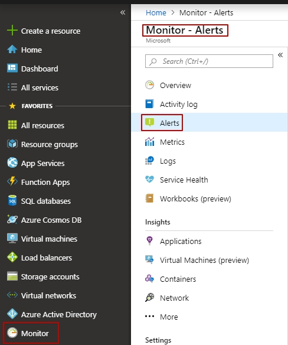

# SCOM Alert Management solution

<!-- TOC -->
- [SCOM Alert Management solution](#scom-alert-management-solution)
  - [Overview](#overview)
  - [Prerequisites](#prerequisites)
    - [Case study](#case-study)
  - [Install SCOM Alert Management solution](#install-scom-alert-management-solution)
    - [Install from the Portal](#install-from-the-portal)
    - [Configuration](#configuration)
    - [Install from the Marketplace](#install-from-the-marketplace)
  - [Verify monitoring solution deploy](#verify-monitoring-solution-deploy)
  - [Automatically create Azure Alert Rules for all SCOM alerts](#automatically-create-azure-alert-rules-for-all-scom-alerts)
  - [Manage alert rules](#manage-alert-rules)
    - [Enable or Disable the generation of Azure Alerts for corresponding SCOM Alerts](#enable-or-disable-the-generation-of-azure-alerts-for-corresponding-scom-alerts)
    - [Log query](#log-query)
    - [Create ITSM work items from Azure alerts](#create-itsm-work-items-from-azure-alerts)
  - [Remove SCOM Alert Management solution](#remove-scom-alert-management-solution)
  - [Troubleshooting](#troubleshooting)

<!-- TOC END -->

## Overview

The SCOM Alert Management solution extends capabilities of Microsoft Alert Management solution with automation of alert rules creation for System Center Operations Manager management group connected to the Log Analytics workspace. The solution creates an alert rule for each SCOM alert type. After Alert rule is available on Azure Monitor, you can manage them as standard scheduled query rules. At the same time, the solution closes SCOM Alerts generated by standard Alert Management solution. Key Scenarios, not available in the Microsoft Alert Management solution:

- Automatically create Azure Alert Rules for all SCOM alerts.
- Propagate SCOM Alert description into Azure Alert events.
- Support enabling and disabling of Azure Alert generation for corresponding SCOM Alerts.
- Support integration scenarios, such as webhooks, action groups, etc.

## Prerequisites

Note: When you install SCOM Alert Management solution it automatically closes all alerts generated by AlertManagement.

Before starting, review the following requirements.

- Download and set up System Center Operation Manager from [here](https://docs.microsoft.com/en-us/system-center/scom/manage-operations-guide-overview?view=sc-om-1807).
- Create a Log Analytics workspace in the Azure portal from [here](https://docs.microsoft.com/en-us/azure/azure-monitor/learn/quick-create-workspace).
- Connect Operations Manager to Azure Monitor from [here](https://docs.microsoft.com/en-us/azure/azure-monitor/platform/om-agents).
- Add the Alert Management solution to your Log Analytics workspace. Instruction is [here](https://docs.microsoft.com/en-us/azure/azure-monitor/platform/alert-management-solution).
- Connect Azure to ITSM tools using IT Service Management Connector [here](https://docs.microsoft.com/en-us/azure/azure-monitor/platform/itsmc-overview)

### Case study

Let's consider the following case when an error has occurred on the client's side.

The error on the client side:

The alert in SCOM:

1. In the portal, select **Monitor** and under the Monitor section - choose **Alerts**.

2. You will land on the Alerts Summary page, which gives you an overview of all your alert instances across Azure.

As you can see, the alert raised in Azure does not have a correspondent alert rule, so you cannot manage this alert - you cannot disable it, change severity, assign an action group.

## Install SCOM Alert Management solution

### Install from the Portal

1. Log in to the Azure portal.
2. Open **All Services** and locate **Solutions**.
3. Click **Add** and find **SCOM Alert Management** solution.

4. Click **Create** to start the installation process.

5. When the installation process starts, you're prompted to provide required configuration.

### Configuration

1. Configure basic settings

- Select a Subscription to link to by selecting from the drop-down list if the default selected is not appropriate.
- For Resource Group, choose to use an existing empty resource group or create a new one.
- Select the same Location as in Log Analytics.

2. Log Analytics Settings

- Type the Log Analytics workspace Resource Group name
- Type the Log Analytics workspace name

3. Summary

- You're prompted to provide information such as the resource group and location in addition to values for any parameters in the solution

4. Buy

- User can read Terms of Use and [Private Policy](https://www.viacode.com/viacode-privacy-statement)

### Install from the Marketplace

1. Open Azure Marketplace
2. Select **Management Tools** and find **SCOM Alert Management** solution

3. Click **Create** to start the installation process.

## Verify monitoring solution deploy

The solution is in a separate resource group and includes two logic apps.

- **AlertCreator** creates a new alert rule.
- **CloseAlerts** closes the original Alert Management solution (unmanageable alerts).

If one of your solution deployments failed during installation, check [Troubleshooting](#Troubleshooting).

## Automatically create Azure Alert Rules for all SCOM alerts

1. In the portal, select **Monitor** and under the Monitor section - choose **Alerts**.

2. You see auto created alert rule. This alert rule generates a new alert. SCOM Alert Management solution displays only new alerts from SCOM. Alerts has been created before installation, would not displayed in Monitor - Alerts.

- Alerts from Alert Management solution would be closed.

- Alert from SCOM Alert Management solution would have New alert state.

## Manage alert rules

### Enable or Disable the generation of Azure Alerts for corresponding SCOM Alerts

You can manage alerts by enabling and disabling them in the alert rule section.
<!-- In the Rule page , you can select multiple alert rules and enable/disable them. This might be useful when certain target resources need to be put under maintenance-->

- If the alert (from SCOM Alert Management solution) is no longer required, click on **Disable** button. 

### Log query

You can view and manage log queries by clicking on the **Condition** value.

### Create ITSM work items from Azure alerts

When creating/editing an Azure alert rule, use an Action group, which has an ITSM Action. When the alert triggers, work item is created/updated in the ITSM tool.

Once you have your ITSM connection created, you can create work item(s) in your ITSM tool based on Azure alerts, by using the ITSM Action in Action Groups.

Use the following procedure:

1. In Azure portal, click **Monitor**.
2. Click **Alerts**
3. In the command bar on the top, click **Manage actions**.
4. Click on **Add action group**.
5. Provide **Name** and **ShortName** for your action group. Select the **Resource Group** and **Subscription** where you want to create your action group.

6. In the Actions list, select **ITSM** from the drop-down menu for **Action Type**. Provide a **Name** for the action and click **Edit details**.
7. Select the **Subscription** where your Log Analytics workspace is located. Select the **Connection** name (your ITSM Connector name) followed by your Workspace name.
8. Select **Work Item** type from the drop-down menu. Choose to use an existing template or fill the fields required by your ITSM product.
9.  Click OK.

* More information you can find on [docs.microsoft.com](https://docs.microsoft.com/en-us/azure/azure-monitor/platform/itsmc-overview)

## Remove SCOM Alert Management solution

1. Open resource group with Logic Apps
2. Click on **Delete resource group**

  
## Troubleshooting

- **Deployment failed**

  If one of your solution deployments failed during installation, perform next steps:

  1. Remove resource group with the solution and deploy it again

  Or you can make these steps

  1. Open Log Analytics resource group.
  2. Select **Access Control (IAM)**.
  3. Click **Add** and choose **Add role assignment**.
  4. Select **Monitoring Contributor** in "Role" textbox, select  **AlertCreator** and **CloseAlerts** for your subscription

